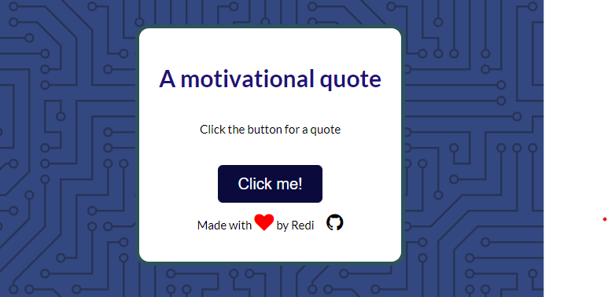

<p align="center">
  

</p>
<hr>
<h1 align="center">MotoQuotes</h1>
<p align="center">
  Built for 
</p>
<hr>
<h1 align="center">Technologies Used</h1>
<h3 align="center"> 


</h3>

<hr>

<h1 align="center">What is MotoQuotes? </h1>
Discipline is key, but we all need a little motivation from time to time. That's where MotoQuotes comes in, offering a collection of inspiring words from famous figures across the world and bringing positivity to your day. A simple yet cool chrome extension.
<hr>

<h1 align="center">Why should I use it? </h1>

- 🌟 Wide Variety of Quotes: Access a diverse range of quotes from famous individuals across various fields.
- 🎯 Easy to Use: Enjoy a user-friendly interface that makes finding and sharing quotes simple.
- 🌞 Daily Motivation: Get a daily dose of inspiration to help you stay focused and motivated.
- 🚀 Boost Productivity: Use quotes to spark creativity and improve your productivity.
- 🌈 Positive Influence: Surround yourself with positive thoughts and wisdom from respected figures.

<hr>

<h1 align="center">Where to find it?</h1>

<h3 align="center">
  
[Web Version](4redi.github.io/Motivational-Quotes/)
<br>
~~[Chrome Widget](https://chrome.com)~~ (Not available yet, just personal use at the moment)

</h3>

<h1 align="center">
  Contributions
</h1>
<p align="center">All contributions from the community are welcomed! Whether you want to add new features, fix bugs, improve documentation, or suggest new quotes, your help is greatly appreciated. Here's how you can get involved:
</p>
Here's how to start:

1) Clone the Repository

``` powershell
git clone https://github.com/your-github-username/Motivational-Quotes.git
```

2) Open an issue
Use the ```Issue``` option

3) Create a branch

``` powershell
git checkout -b feature/your-feature-name
```

4) Add a commit message

``` powershell
git commit -m "A main message" -m "A caption, use this to explain your feature further"
```

5) Push the changes

``` powershell
git push origin feature/your-feature-name
```


<hr>

<h1 align="center"> Enjoy!</h1>
